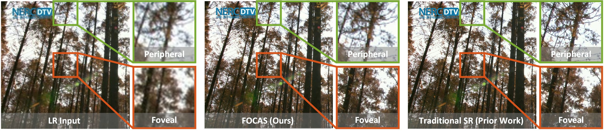

# FOCAS: Practical Practical Video Super Resolution using Foveated Rendering

by Lingdong Wang, Mohammad Hajiesmaili, Ramesh K. Sitaraman


Paper Link: [https://dl.acm.org/doi/abs/10.1145/3474085.3475673](https://dl.acm.org/doi/abs/10.1145/3474085.3475673)

## Overview
This is the official implementation of FOCAS in [PyTorch](http://pytorch.org/). 

FOCAS (**Fo**veated **Cas**caded Video Super Resolution) is a foveated video super resolution method, which improves the resolution of an input video according to human vision.
FOCAS assigns a higher visual quality to the central foveal region of human vision, and a lower quality to the less sensitive peripheral region. 
In this way, FOCAS largely reduce the inference latency of deep learning model without noticeable perceptual degradation.


## Prerequisite 
python3.x, pytorch, cvxpy


## Model Weight

FOCAS is applied to the inference phase of deep learning models. 
In other words, FOCAS does not affect the training of models, thus shares the same weight with its backbone model. 
Here we adopt [RRN](https://github.com/junpan19/RRN) as our baseline model.
We provide model weights of RRN-3L/5L/10L in pretrained/ folder, where RRN-xL means there are x residual blocks in the model.
RRN-10L can be directly used for the FOCAS models we provide here.


## Dataset
In the training phase, FOCAS is trained and evaluated on [Vimeo-90K](http://toflow.csail.mit.edu/) dataset for super resolution.
Please organize the dataset in the following way (txt files are in the dataset/ folder). Note that the sequences/ folder is used as the dataset path. 

```
vimeo_septuplet/
    sequences/
        sep_trainlist.txt
        sep_testlist.txt
        00001/
        ...
        00096/
```

In the inference phase, FOCAS is evaluated with HD videos from [HD_UHD_Eyetracking_Videos](https://web.archive.org/web/20210224171150/http://ivc.univ-nantes.fr/en/databases/HD_UHD_Eyetracking_Videos/).
We provide a script dataset/download_hd.sh to download and organize this dataset as following. 
You can also download the dataset via [Dropbox](https://www.dropbox.com/s/f7gj0c5sxfe34ap/UD_UHD_EyeTracking_Videos.tar.gz?dl=0) (44.6GB).
The HD_UHD_Eyetracking_Videos/ folder is used as the dataset path.

```
HD_UHD_Eyetracking_Videos/
    Gaze_Data/
        HD/
    Videos/
        HD/
```


## Training Phase
Run the following command to train FOCAS model (actually degraded to an RRN model):

```
python3 main.py --model RRN10 --log_name train_rrn10 --data_dir [Your Dataset Path]/vimeo_septuplet/sequences/
```

Here model specifies the model name, log_name is used for saving outputs, and data_dir indicates the path to the inference dataset.
For a speedy training, the code is recommended to run in a parallel mode. For example, assign the above program with 4 GPUs and set --threads as 8.

To evaluate the model performance on the training dataset (Vimeo-90K), use the following code:

```
python3 main.py --test --model RRN10 --log_name test_rrn10 --pretrained_path [Model Path] --data_dir [Dataset Path]/vimeo_septuplet/sequences/
```

Here pretrained_path identifies the path of model to be evaluated.

## Inference Phase
To perform FOCAS inference in a non-recurrent manner, run the following code:

```
python3 infer_non_rec.py --model FOCAS25 --log_name infer_focas25_non --data_dir [Dataset Path]/HD_UHD_Eyetracking_Videos/
```

Recurrent FOCAS can be conducted using:

```
python3 infer_rec.py --model1 RRN10 --model2 FOCAS25 --duration1 1 --duration2 3 --log_name infer_focas25 --data_dir [Your Dataset Path]/HD_UHD_Eyetracking_Videos/
```

To stabilize recurrent FOCAS's performance, it's necessary to alternatively use full-size SR (RRN10) and FOCAS model (FOCAS25). 
We set duration1=1 and duration2=3 to make the first frame out of 4 is processed by RRN10, and the rest 3 are by FOCAS25.

## Customized FOCAS Model

The FOCAS models provided in the paper can be called by focas_generator() function in model/focas.py. Here we provide the architecture of FOCAS-15/16/17/20/25.
Model FOCAS-t runs less than t ms on our server, but may have different latency in your environment.

To generate a customized FOCAS model satisfying a given latency limit in your environment, you can use the following command in your computing environment,
where T specifies the required latency limit:

```
python3 quality_allocation.py --latency T
```

This program will firstly  measure inference latencies of 108 sampled FOCAS models, and then fit a latency estimation model with these data.
This step may cost some time depending on the GPU resources of its running environment.

Finally, it solves a quality allocation problem to determine the optimal FOCAS model architecture.
The program will output the optimal solution at the end as following:

 ```
--------- optimal solution ---------
blocks [1, 7, 10]
regions [(1080, 1920), (512, 512), (416, 416)]
estimated latency 19.999850814407207
estimated quality 0.998622494888278
```
Assign blocks and regions to the FOCAS model in model/focas.py, and they will jointly define the customized FOCAS model structure.
Estimated latency is the latency calculated by the previous latency estimation model. 
Estimated quality ranges from 0 to 1, hinting the foveated visual quality of the customized FOCAS model.

More details about the quality allocation can be found in our paper.
